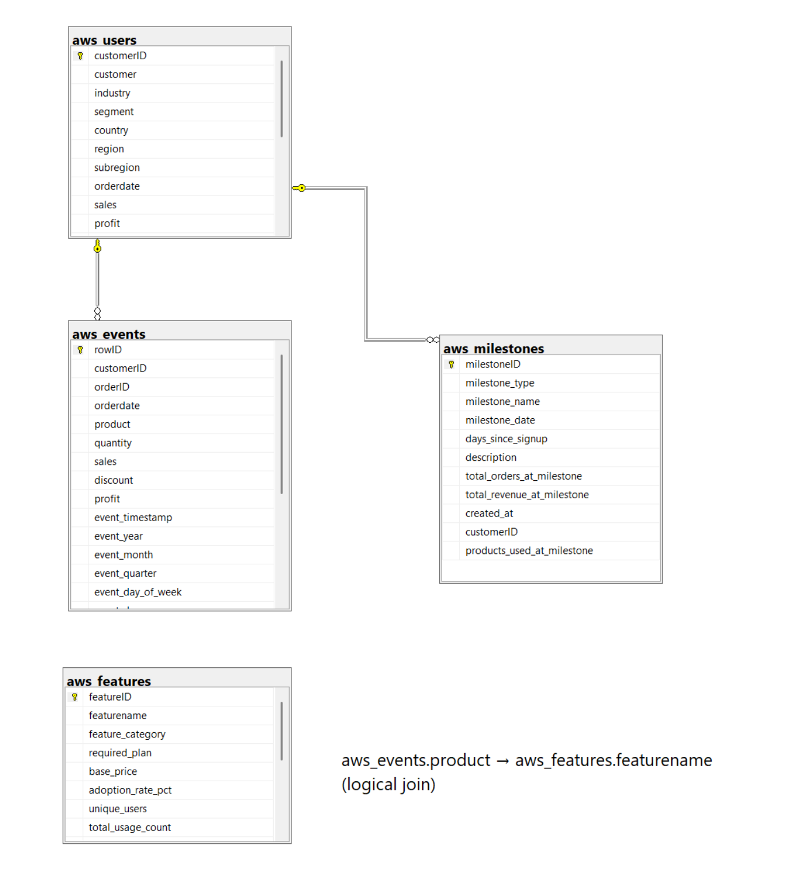

# AWS SaaS Analytics Database

## Overview
End-to-end business intelligence solution analyzing B2B SaaS product adoption, customer behavior, and revenue performance using 9,994 transactions.

## Tech Stack
- **Database:** SQL Server
- **Data Modeling:** Star Schema (2 dimensions, 2 facts)
- **Analytics:** Power BI
- **Tools:** Python (EDA), n8n (automation)

## Database Schema

### Tables
- **aws_users** (Dimension) - Customer profiles with 950 customers
- **aws_events** (Fact) - 9,994 transaction records
- **aws_features** (Dimension) - 15 product features
- **aws_milestones** (Fact) - 3,500+ lifecycle events

### Schema Diagram


## Project Structure
```
├── schema/                    # Database structure (tables, FKs, indexes)
├── stored_procedures/         # Transformation logic (derived columns)
├── sample_queries/           # Example analytics queries
└── README.md
```

## Setup Instructions

1. **Create Database**
```sql
   CREATE DATABASE AWSSaaSDB;
```

2. **Run Schema Scripts (in order)**
```
   schema/01_create_tables.sql
   schema/02_create_foreign_keys.sql
   schema/03_create_indexes.sql
```

3. **Load Data**
   - Import CSV to tables using SQL Server Import Wizard

4. **Generate Derived Columns**
```sql
   EXEC aws_customer360_view;
   EXEC aws_events_derived_columns;
   EXEC aws_features_derived_columns;
   EXEC aws_milestones_derived_columns;
```

5. **Query Away!**
   - See `sample_queries/` for examples

## Key Features

### Customer Intelligence
- CLV segmentation (Platinum, Gold, Silver, Bronze)
- Engagement scoring (New, Active, High-Value, Strategic, At Risk)
- Multi-product adoption tracking

### Behavioral Analytics
- Event sequencing and customer journey mapping
- Session duration analysis
- Device usage patterns (Desktop/Mobile/Tablet)

### Product Performance
- Adoption rate tracking
- Profit margin analysis by feature
- Usage frequency metrics

### Lifecycle Tracking
- Milestone funnel (Signup → Activation → Active → Power User)
- Cohort retention analysis
- Time-to-value metrics

## Business Insights

From this database, you can answer:
- Which customers are at churn risk?
- What's the typical path from signup to power user?
- Which products drive highest retention?
- What usage patterns predict success?

## Related Articles

- **Part 1:** [Exploratory Data Analysis](https://srivatsakurada.substack.com/p/the-discount-death-trap-a-strategic)
- **Part 2:** [AI-Assisted SQL Development]
- **Part 3:** Power BI Dashboards (coming soon)

## Contact

- **LinkedIn:** https://www.linkedin.com/in/srivatsa-kurada
- **Portfolio:** https://srivatsa-kurada-hmj3p8m.gamma.site/
- **Email:** mailto:srivatsakurada@gmail.com
```

---